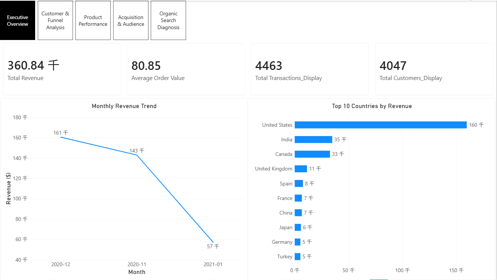
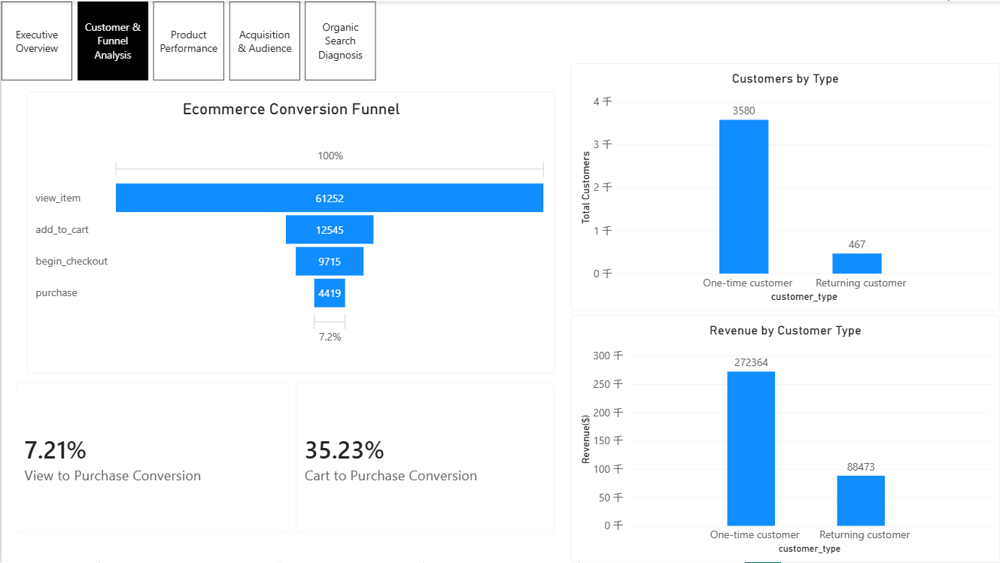
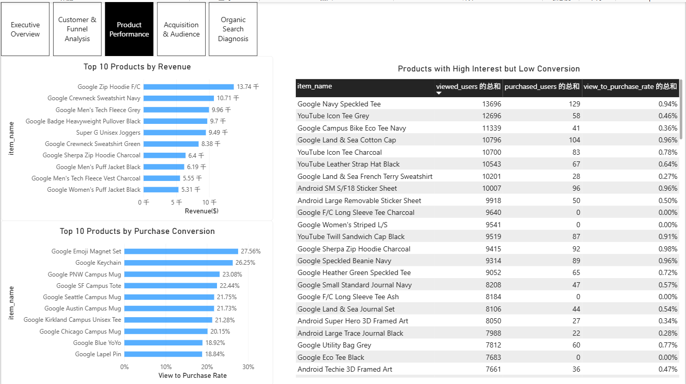
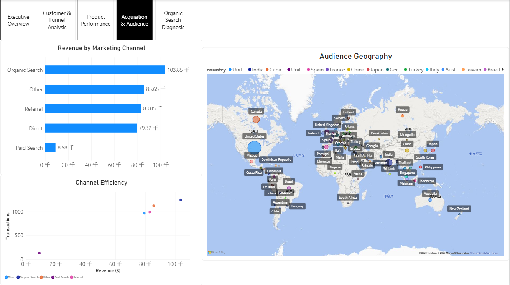
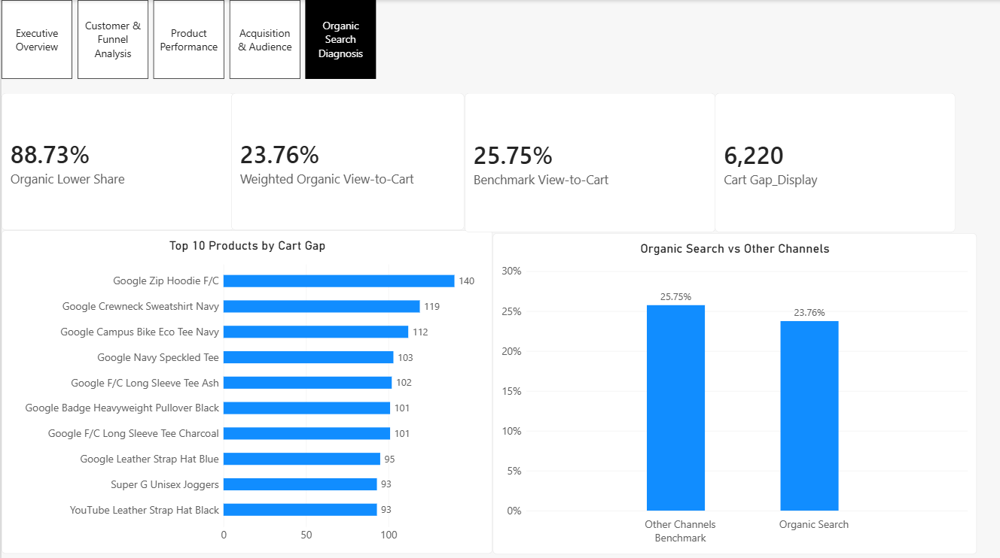

# GA4 Ecommerce Conversion Analysis

> **BigQuery SQL × GA4 Event Data × Power BI**  
> 从经营概览与用户漏斗出发，进一步下钻商品 × 渠道转化差异，并对 Organic Search 的加购转化缺口进行量化诊断。

---

## Project Overview

本项目基于 Google Analytics 4 Public Ecommerce Dataset，使用 BigQuery 对 GA4 事件级嵌套数据进行数据探索、质量检查、经营指标计算、用户漏斗、商品表现、客户价值及渠道分析，并使用 Power BI 构建可视化 Dashboard。

在完成基础经营分析后，进一步针对整体漏斗中较低的 **View → Add to Cart** 转化率展开自主诊断：

**设备差异 → 渠道差异 → 商品 × 渠道匹配 → 同商品基准比较 → Cart Gap 量化**

最终发现，Organic Search 在多数可比商品上的加购转化率低于同商品其他渠道，并进一步定位 Cart Gap 贡献较高的重点商品。

---

## Dataset

数据来源：

`bigquery-public-data.ga4_obfuscated_sample_ecommerce.events_*`

分析时间范围：

**2020-11-01 ～ 2021-01-31**

数据规模：

- **4,295,584** 条 GA4 事件
- **270,154** 名匿名用户
- **354,970** 次 Session

主要字段包括：

- 用户行为事件 `event_name`
- 匿名用户 ID `user_pseudo_id`
- Ecommerce 交易信息
- 商品明细 `items`
- Traffic Source / Medium
- Device
- Geography

GA4 数据采用事件级嵌套结构，因此分析过程中使用 `UNNEST()` 处理 `items` 等重复字段。

---

## Business Questions

本项目主要回答以下问题：

1. 网站整体经营表现如何？
2. 用户从商品浏览到最终购买，主要流失发生在哪个环节？
3. 哪些商品贡献收入最高，哪些商品购买转化更高？
4. 哪些商品存在“高浏览、低购买”的转化问题？
5. 一次性客户与回购客户的价值有何差异？
6. 不同获客渠道的收入贡献和效率有何区别？
7. View → Add to Cart 的转化损失主要来自设备、渠道还是商品 × 渠道匹配差异？
8. Organic Search 的转化差异对应多大的 benchmark gap，应优先关注哪些商品？

---

## Analysis Workflow

```text
GA4 Raw Events
      ↓
Data Discovery
      ↓
Data Quality Validation
      ↓
Business KPIs
      ↓
Conversion Funnel
      ↓
Customer / Product / Channel Analysis
      ↓
Product × Channel Diagnosis
      ↓
Matched-product Benchmark
      ↓
Cart Gap Quantification
      ↓
Power BI Dashboard
```

---

## Data Quality

在正式计算业务指标前，对关键字段进行了完整性检查，包括：

- `user_pseudo_id`
- `event_timestamp`
- `transaction_id`
- `purchase_revenue`
- 商品 `price`
- 商品 `quantity`

分析发现部分 Purchase 事件存在 transaction ID、Revenue 或商品字段缺失，因此涉及交易和收入的指标均使用明确的数据有效性条件进行计算。

---

## Key Findings

### 1. Conversion Funnel

用户级漏斗：

| Funnel Stage | Users |
|---|---:|
| View Item | 61,252 |
| Add to Cart | 12,545 |
| Begin Checkout | 9,715 |
| Purchase | 4,419 |

对应转化率：

- **View → Cart：20.48%**
- **Cart → Checkout：77.44%**
- **Checkout → Purchase：45.49%**
- **View → Purchase：7.21%**

浏览 → 加购是最明显的前段流失环节，因此被作为后续重点诊断对象。

---

### 2. Customer Value

客户按购买次数划分为一次性客户与回购客户。

- One-time customers：约 **3.58K**
- Returning customers：约 **467**

虽然回购客户数量明显更少，但其人均收入约 **189.45**，高于一次性客户约 **76.08**。

这表明：

> 回购客户规模较小，但单用户价值明显更高，用户留存与复购值得进一步关注。

---

### 3. Product Performance

商品分析从三个角度展开：

- Revenue contribution
- Purchase conversion
- High interest but low conversion

“高浏览、低购买”商品筛选条件：

```text
viewed_users > 1000
AND
view_to_purchase_rate <= 1%
```

该分析用于识别已经获得较高用户关注、但购买承接偏弱的商品。

---

## Custom Extension: Organic Search Conversion Diagnosis

以下部分为本项目在基础分析框架之上的自主扩展。

### Step 1. Device Check

首先按设备类型拆解 View → Cart。

结果显示 Mobile、Desktop、Tablet 之间的转化差异相对有限，因此未发现明显的单一设备端异常。

这一步用于排除：

> “低加购率主要由某个设备端体验导致”

这一假设。

---

### Step 2. Product × Channel Analysis

进一步按照：

**Product × Marketing Channel**

拆解 View → Cart。

为降低小样本带来的波动，仅保留：

```text
view_users >= 300
```

的商品 × 渠道组合。

部分商品在不同渠道之间出现约 **8～10 个百分点**的 View → Cart 差异，说明渠道与商品之间存在明显异质性。

---

### Step 3. Identify the Most Frequent Underperforming Channel

对于同商品不同渠道之间转化差距 ≥5 个百分点的商品，统计其最低转化渠道：

| Lowest-performing Channel | Products | Avg Gap |
|---|---:|---:|
| Organic Search | 28 | 6.45pp |
| Direct | 5 | 6.06pp |
| Paid Search | 2 | 7.05pp |
| Referral | 1 | 6.53pp |
| Other | 1 | 5.42pp |

在存在明显渠道差异的商品中，Organic Search 最频繁成为最低转化渠道。

---

### Step 4. Matched-product Benchmark

为了减少商品结构差异的影响，对同一商品在 Organic Search 与其他渠道中的表现进行匹配比较。

共得到 **204 个可比商品**：

- Organic Search 转化低于其他渠道均值：**181 个**
- 占比：**88.73%**
- Organic Search 平均 View → Cart：**23.60%**
- 同商品其他渠道平均：**25.52%**
- 平均差距：**1.92pp**

结果表明：

> Organic Search 的转化弱势并非由少数异常商品单独造成，而是在多数可比商品中均有体现，但平均差距属于广泛而非极端的差异。

---

### Step 5. Weighted Business Impact

进一步按 Organic Search 商品浏览规模加权：

- Organic Search Views：**311,733**
- Actual Carts：**74,054**
- Weighted Organic View → Cart：**23.76%**
- Matched Other-channel Benchmark：约 **25.75%**
- Benchmark Carts：约 **80.3K**
- Benchmark Cart Gap：约 **6.2K**
- Gap 相当于当前 Organic Search 加购规模的约 **8.4%**

> **Cart Gap 是基于同商品其他渠道平均转化率构造的 benchmark gap，仅用于衡量渠道差异规模，不代表因果意义上的实际用户损失。**

---

### Step 6. Priority Products

进一步将 Cart Gap 下钻至商品层级，用于识别优先排查对象。

Cart Gap 较高的商品包括：

- Google Zip Hoodie F/C
- Google Crewneck Sweatshirt Navy
- Google Campus Bike Eco Tee Navy
- Google Navy Speckled Tee
- Google F/C Long Sleeve Tee Ash

这些商品可以作为后续分析的优先对象，例如进一步检查：

- Organic Search 搜索意图
- Landing Page
- 商品信息匹配度
- 价格
- 库存
- 页面体验
- 商品吸引力

---

## Dashboard

Power BI Dashboard 共 **5 页**。

其中前 4 页完成整体经营、用户、商品和获客分析，第 5 页为自主扩展的 Organic Search 转化诊断。

### 1. Executive Overview



### 2. Customer & Funnel Analysis



### 3. Product Performance



### 4. Acquisition & Audience



### 5. Organic Search Diagnosis



---

## SQL Files

项目 SQL 按分析流程拆分为 7 个文件：

| File | Description |
|---|---|
| `01_data_discovery.sql` | 数据规模、事件、用户、设备、国家及流量来源摸底 |
| `02_data_quality.sql` | 用户、时间、交易、收入及商品字段的数据质量检查 |
| `03_business_metrics.sql` | Revenue、订单、AOV、国家、渠道及 Funnel 指标 |
| `04_product_analysis.sql` | 商品收入、View→Cart、View→Purchase 及高兴趣低转化商品 |
| `05_customer_analysis.sql` | 一次性客户、回购客户与用户价值分析 |
| `06_analytics_tables.sql` | 创建 Power BI 使用的分析层数据表 |
| `07_organic_search_diagnosis.sql` | 商品×渠道诊断、Matched Benchmark 与 Cart Gap 量化 |

其中：

**`07_organic_search_diagnosis.sql` 为本项目的主要自主扩展分析。**

---

## Project Structure

```text
ga4-ecommerce-conversion-analysis/
│
├── README.md
│
├── sql/
│   ├── 01_data_discovery.sql
│   ├── 02_data_quality.sql
│   ├── 03_business_metrics.sql
│   ├── 04_product_analysis.sql
│   ├── 05_customer_analysis.sql
│   ├── 06_analytics_tables.sql
│   └── 07_organic_search_diagnosis.sql
│
└── dashboard/
    ├── README.md
    ├── 01_executive_overview.png
    ├── 02_customer_funnel_analysis.png
    ├── 03_product_performance.png
    ├── 04_acquisition_audience.png
    └── 05_organic_search_diagnosis.png
```

---

## Tech Stack

- **Google BigQuery**
- **SQL**
- **GA4 Event-level Data**
- **Power BI**
- **DAX**
- `UNNEST`
- CTE
- `CASE WHEN`
- `COUNT DISTINCT`
- `SAFE_DIVIDE`
- Funnel Analysis
- Customer Segmentation
- Product Performance Analysis
- Channel Diagnosis
- Matched-product Benchmark

---

## Analytical Approach

本项目重点采用以下分析思路：

1. **先检查数据质量，再计算指标**
2. **从整体指标定位异常环节**
3. **提出可能解释并逐层下钻验证**
4. **通过同商品比较降低商品结构差异影响**
5. **用 Benchmark 量化差异规模**
6. **进一步定位贡献差异最大的商品**
7. **区分观察性结果与因果结论**

完整诊断路径：

```text
View → Cart 较低
      ↓
检查设备差异
      ↓
设备差异有限
      ↓
检查渠道差异
      ↓
商品 × 渠道下钻
      ↓
同商品匹配比较
      ↓
Organic Search 多数商品偏低
      ↓
量化 Benchmark Cart Gap
      ↓
识别高 Gap 商品
```

---

## Limitations

本项目仍存在以下限制：

- 数据来自 Google 提供的公开脱敏 GA4 Sample Dataset。
- 部分 Purchase、Revenue 和 Item 字段存在缺失。
- 无广告成本、曝光和 CPC 等投放成本数据，因此不能评价渠道 ROI。
- 无搜索关键词、Landing Page 等更细粒度 Organic Search 信息。
- 商品 × 渠道分析属于观察性分析，无法证明渠道对转化率存在因果影响。
- Benchmark Cart Gap 是对标估算，不等同于实际可追回的用户或收入损失。

---

## Attribution

本项目的基础分析框架参考并复现：

[Anastasiia A. Petrova — GA4 Ecommerce Analytics](https://github.com/Anastasiia-A-Petrova/ga4-ecommerce-analytics)

在完成基础项目复现后，本项目进一步自主扩展：

- View → Cart 前段漏斗诊断
- Device × Channel 分析
- Product × Channel 转化分析
- Matched-product Benchmark
- Organic Search Conversion Diagnosis
- Benchmark Cart Gap Quantification
- 第 5 页 Power BI Diagnosis Dashboard

---

## Notes

本项目重点不是将渠道差异直接解释为因果关系，而是展示一套完整的数据分析流程：

> **发现问题 → 提出假设 → 分维度验证 → 排除弱解释 → 同类比较 → 量化影响 → 定位优先对象 → 明确结论边界**
